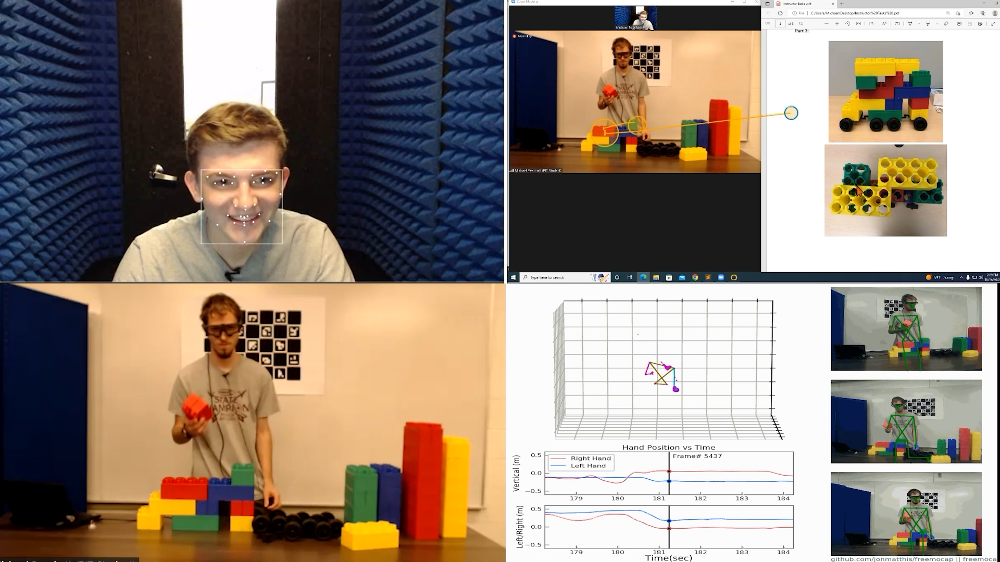

#  MULTICOLLAB
MULTICOLLAB is a novel multimodal corpus for affective computing. This IRB-approved study was collected from 48 subjects, forming 24 builder and instructor pairs. Through a Zoom call, the instructor guided the builder through two tasks. This processed dataset consists of the instructor's facial features, eye tracking features, galvanic skin resposne, audio features, and manually verified transcipts surrounding the instances of annotation. All values are z-Score normalized per modality. The annotations were provided by the instructor using a web-based online tool. See the [full paper here](https://aclanthology.org/2024.lrec-main.1023.pdf).

## Dataset Description
### File Structure
We provide files X and Y tsv files while varying time window and time steps. When using this data for modeling, use the same X and y time window listed in the filename.

### Video Sample

[Watch it here](https://vimeo.com/839024815)

### Details
Each X file specifies a time window and the time dimension from the instructor's self annotated instance of frustration. The columns are labeled `m1, m2, ..., m12` and correspond to the following z-score normalized features:
```
——— Modality Labels ———
m1 = Brow Furrow
m2 = Chin Raise
m3 = Lip Corner Depressor
m4 = Lid Tighten
m5 = Gaze Velocity
m6 = Fixation Duration
m7 = Fixation Dispersion
m8 = Saccade Duration
m9 = Saccade Peak Velocity
m10 = GSR Conductance CAL
m11 = Intensity_dB
m12 = F0_Hz
```
Additionally, each column also includes a time step per modality, denoated as `m1_t1, m2_t1, ..., m12_tn` where `n = time dimension`. For example, a file named `X_1500milli_5dim.tsv` contains the z-score normalized sensor values within a 1500 millisecond time window from annotation, split up into 5 timesteps. Therefore, it will contain 60 columns (12 modalities x 5 time steps), or `m1_t1, m2_t1, ..., m12_t5`.

Instructor utterance word tokens can be found in the corresponding Y file in the `Utterance` column. For example, Tt find the words the instructor uttered in a 15000 millisecond time window from when they rated their level of frustration, see the `Utterance` column in the file `Y_1500milli.tsv`.

## Disclaimer and License
This dataset is licensed under the <a href="https://creativecommons.org/licenses/by-nc/4.0/" target="_blank">Creative Commons Attribution-NonCommercial 4.0 International License (CC-BY-NC-4.0)</a> and subject to [DISCLAIMER](DISCLAIMER.txt). 

## BibTeX Citation
```
@inproceedings{peechatt-etal-2024-multicollab-multimodal,
    title = "{MULTICOLLAB}: A Multimodal Corpus of Dialogues for Analyzing Collaboration and Frustration in Language",
    author = "Peechatt, Michael  and
      Alm, Cecilia Ovesdotter  and
      Bailey, Reynold",
    editor = "Calzolari, Nicoletta  and
      Kan, Min-Yen  and
      Hoste, Veronique  and
      Lenci, Alessandro  and
      Sakti, Sakriani  and
      Xue, Nianwen",
    booktitle = "Proceedings of the 2024 Joint International Conference on Computational Linguistics, Language Resources and Evaluation (LREC-COLING 2024)",
    month = may,
    year = "2024",
    address = "Torino, Italy",
    publisher = "ELRA and ICCL",
    url = "https://aclanthology.org/2024.lrec-main.1023",
    pages = "11713--11722",
    abstract = "This paper addresses an existing resource gap for studying complex emotional states when a speaker collaborates with a partner to solve a task. We present a novel dialogue resource {---} the MULTICOLLAB corpus {---} where two interlocutors, an instructor and builder, communicated through a Zoom call while sensors recorded eye gaze, facial action units, and galvanic skin response, with transcribed speech signals, resulting in a unique, heavily multimodal corpus. The builder received instructions from the instructor. Half of the builders were privately told to disobey the instructor{'}s directions. After the task, participants watched the Zoom recording and annotated their instances of frustration. In this study, we introduce this new corpus and perform computational experiments with time series transformers, using early fusion through time for sensor data and late fusion for speech transcripts. We then average predictions from both methods to recognize instructor frustration. Using sensor and speech data in a 4.5 second time window, we find that the fusion of both models yields 21{\%} improvement in classification accuracy (with a precision of 79{\%} and F1 of 63{\%}) over a comparison baseline, demonstrating that complex emotions can be recognized when rich multimodal data from transcribed spoken dialogue and biophysical sensor data are fused.",
}
```
 
## Contact
For any questions about this dataset, please contact Michael Peechatt at [mp6510@rit.edu](mailto:mp6510@rit.edu).
